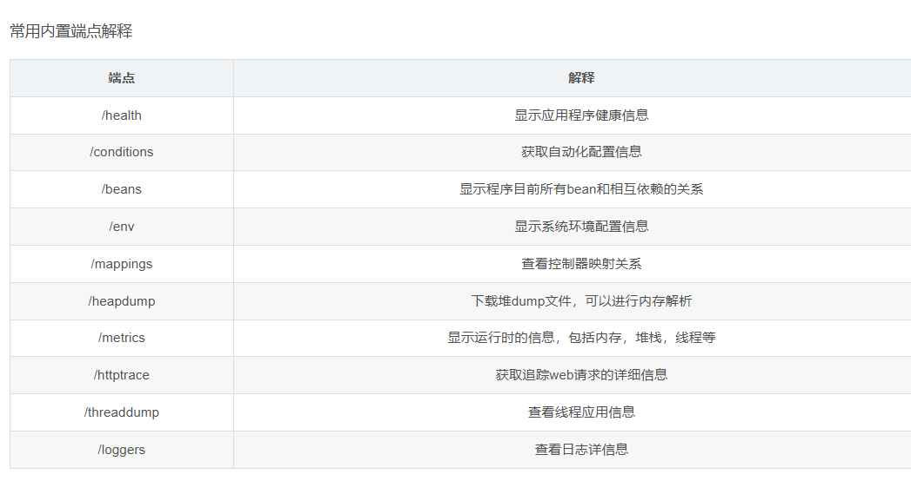

# actuator

执行器端点（endpoints）可用于监控应用及与应用进行交互，
Spring Boot包含很多内置的端点，你也可以添加自己的。
例如，health端点提供了应用的基本健康信息。 端点暴露的方式取决于你采用的技术类型，大部分应用选择HTTP监控，端点的ID映射到一个URL。例如，health端点默认映射到/health。

# Spring Boot 可视化监控

们将创建一个Spring Boot应用程序，在Spring Actuator，Micrometer，Prometheus和Grafana的帮助下来监控系统。其中，Spring Actuator和Micrometer是Spring Boot App的一部分。

们将创建一个Spring Boot应用程序，在Spring Actuator，Micrometer，Prometheus和Grafana的帮助下来监控系统。其中，Spring Actuator和Micrometer是Spring Boot App的一部分。

作者：Java技术栈
链接：https://juejin.cn/post/7007971438082654245
来源：稀土掘金
著作权归作者所有。商业转载请联系作者获得授权，非商业转载请注明出处。

生产环境中会用到 Prometheus 和 Grafana

